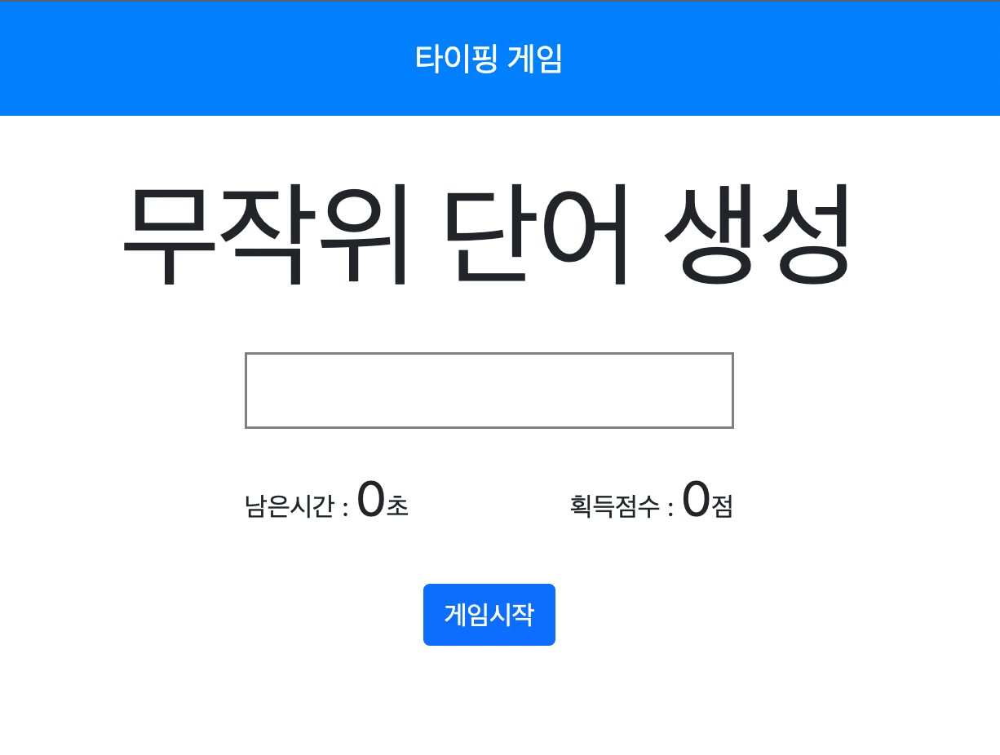

# TypingGame
Vanilla javascript로 구현한 타이핑게임입니다.
구현기간 : 2021년 11월 6일 ~ 12월 8일 (약 1달간)
사용언어 : HTML/CSS/Javascript <br><br>

## 게임방법
1. https://jirongkim.github.io/TypingGame/ 접속
2. 게임시작 버튼 누르기
3. 화면에 표시되는 영단어를 텍스트박스에 입력 후 Enter! <br><br>

## 기능설명
1. https://random-word-api.herokuapp.com/word?number=1000 해당 사이트 Ajax Get 요청하여 랜덤 단어를 받아옵니다. 

```
axios.get('https://random-word-api.herokuapp.com/word?number=1000')
  .then(function (response) {
    response.data.forEach((word) => {
      if(word.length < 10){
        words.push(word);
      }
    });
    buttonChange('게임시작');
    console.log('finish');
    callback(words);
  })
  .catch(function (error) {
    // handle error
    console.log(error);
  });
```
<br><br>

2. Enter Key가 입력되면, 입력한 영단어와 정답이 일치한지 확인합니다.
```
if(window.event.keyCode == 13)
    {
      if(userText.value == answer.innerText && GAMEINFO.isPlaying)
      {
        toast('1점 추가!');
        ...
      }
      else {
        toast('틀렸습니다!');
      }
    }
```

<br><br>
3. 좌측 상단에 표시되는 Toast 메세지는 이렇게 구현했습니다!
```
let removeToast;
export var toast = function(string) {
    const toast = document.getElementById("toast");

    toast.classList.contains("reveal") ?
        (clearTimeout(removeToast), removeToast = setTimeout(function () {
            document.getElementById("toast").classList.remove("reveal")
        }, 1000)) :
        removeToast = setTimeout(function () {
            document.getElementById("toast").classList.remove("reveal")
        }, 1000)
    toast.classList.add("reveal"), toast.innerText = string;
  }
```
<br><br>
## 전체 디자인

